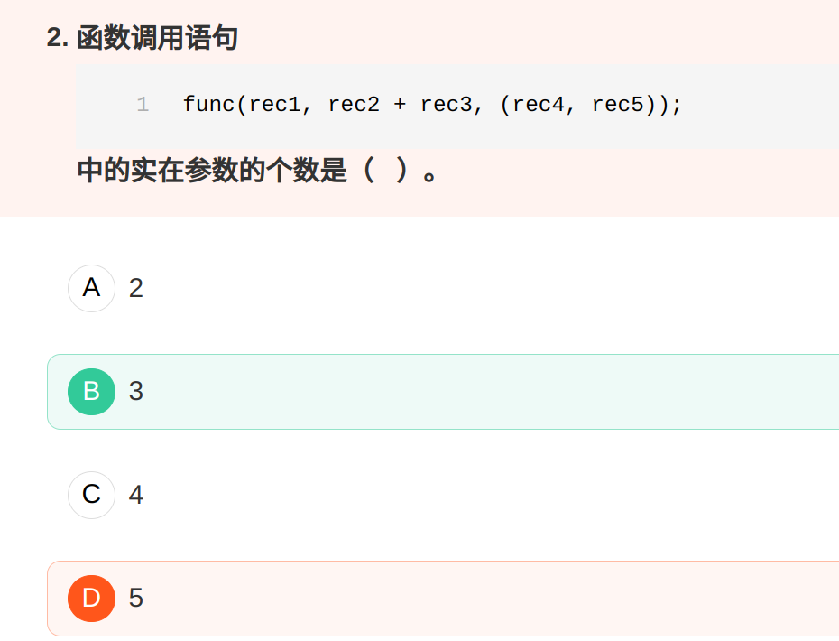
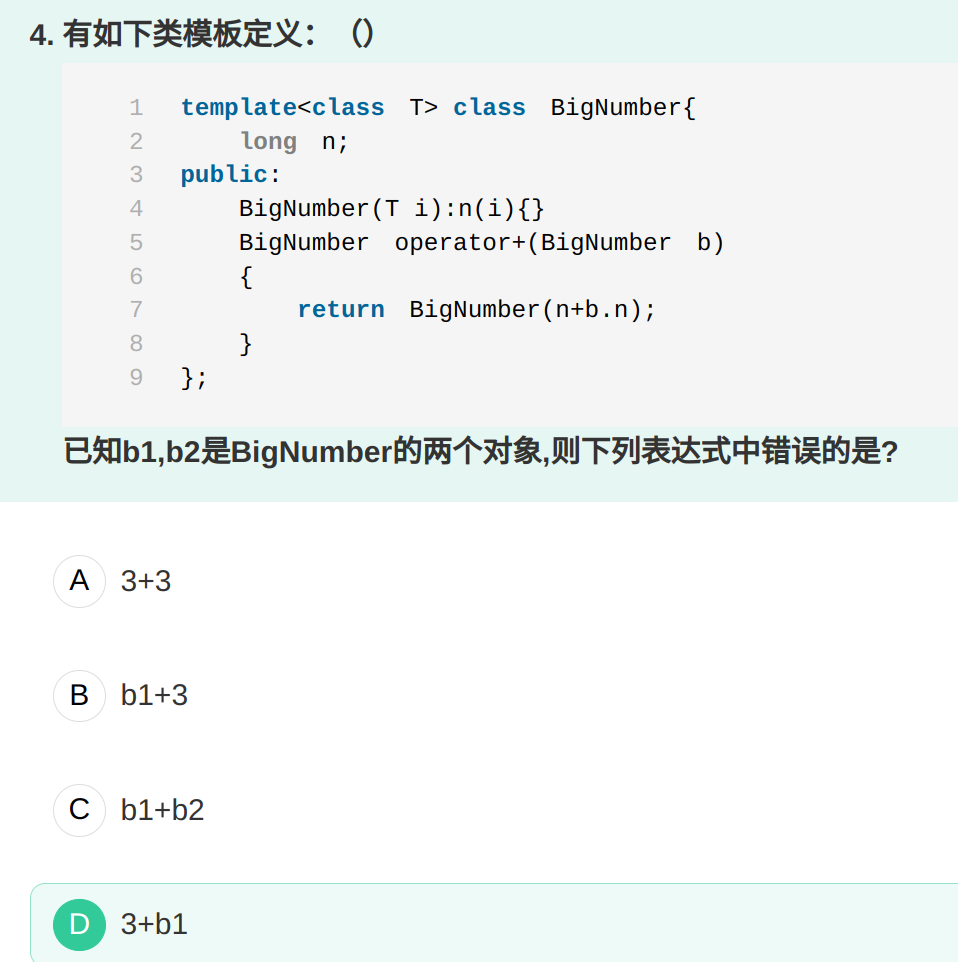

# 函数参数

# 重载函数习题

定义为成员函数的双目操作符重载，左操作数必须是类的对象。

如果你需要为某个函数的所有参数（包括this指针所指的那个隐喻参数）进行类型转换，那么这个函数必须是个非成员函数。------《Effective C++》 

所以砖家一般建议+这样的重载运算符不要定义成为成员函数 

# 重载函数

如果同一个作用域内几个函数名字相同，但形参列表不同，我们称之为重载函数。

## 定义重载函数