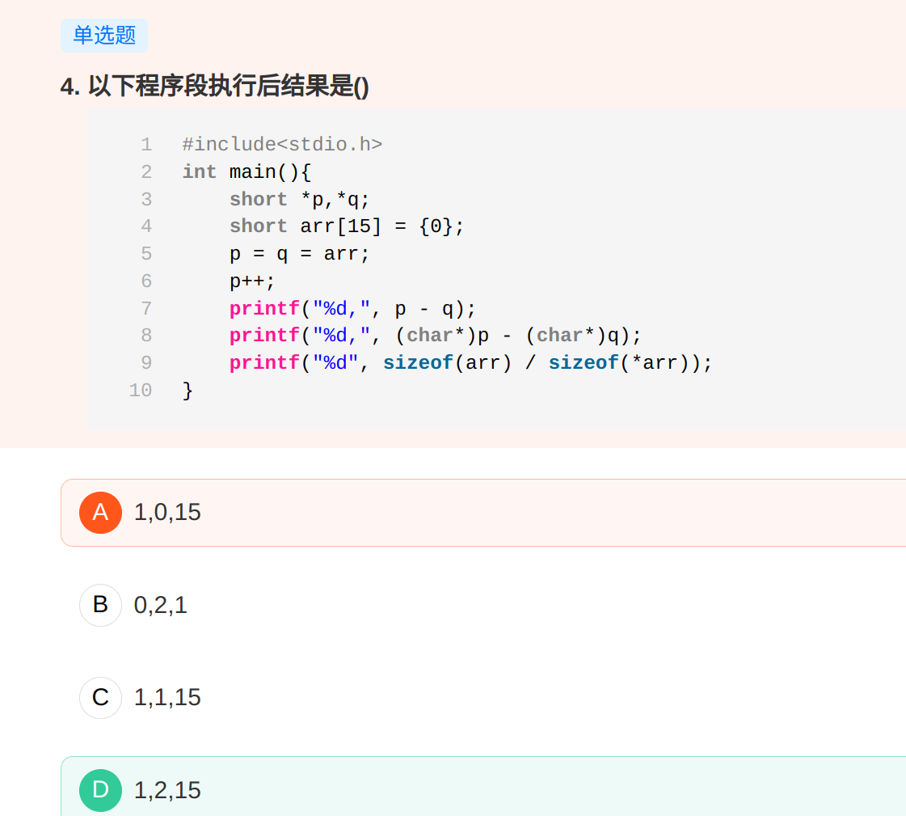

# 指针类题目



指针相减的值就是两指针直接相差元素的个数。

p和q指针地址差两个字节，但是移动只需要一次。同样，第二个偏移没变但是类型改为char*类型每次移动一个字节，所以移动两次。    


# 复合类型

复合类型是指基于其他类型定义的类型。c++中引用和指针就是复合类型。

一条声明语句由一个基本数据类型和紧随其后的一个声明符列表组成。

## （左值）引用

引用为对象起了另外一个名字，引用类型引用另外一种类型。通过将声明符写成 &d 的形式来定义引用类型，其中 d 是声明的变量名：

```c++
int ival = 1024;
int&refval = ival;  //refval 指向 ival (相当于 ival 的另一个名字)
```

### 引用必须被初始化


### 引用即别名


### 引用的定义

除了两种例外情况，其他所有引用的类型都要和与之绑定的对象严格匹配。而且，引用只能绑定在对象上，而不能与字面值或者某个表达式的结果绑定在一起。

```c++
int &refval4 = 10;  // 错误：引用类型的初始值必须是一个对象
```

## 指针 pointer

```c++
int *ip1, *ip2;
```


指针是指向（point to）另外一种类型的复合类型。与引用类似，指针也实现了对其他对象的间接访问。

然而指针与引用相比又有很多不同点。

其一，

其二，

### 获取对象的地址 &

```c++
int ival = 42;
int *p   = &ival;
```

除了两种例外情况，其他所有指针的类型都要和所指对象严格匹配。


### 指针值

以下 4 种之一：


### 利用指针访问对象 *

```c++
int ival = 42;
int *p   = &ival;
cout     << *p;
```


对指针解引用会得出所指的对象，因此如果给解引用的对象赋值，也就是给指针所指的对象赋值。

解引用操作仅适用于确实指向了某个对象的有效指针。

### 空指针

```c++
int *p1 = nullptr;
int *p2 = 0;
int *p3 = NULL;
```

把 int 变量直接赋值给指针是错误操作，即是 int 变量的值刚好等于 0

```c++
int zero = 0;
int *p = zero;
```


### 赋值和指针

指针和引用都能提供对其他对象的间接访问，然而在具体细节上二者有很大的不同，其中最重要的一点就是，引用本身并非一个对象，一旦定义了引用，就无法令其在绑定到其他对象，之后每=次使用这个对象都是访问最初绑定的对象。

指针和它存放的地址就没有这种限制。和其他任何变量一样（除了引用），给指针赋值就是令他存放一个新的地址，从而指向新的对象。

```c++
int i = 42;
int *pi  = 0;    // pi  被初始化，但是并未指向任何对象
int *pi2 = &i;   // pi2 被初始化，存有 i 的地址
```


### 其他指针操作

只要指针拥有一个合法的值，就能将它用在条件表达式中。任何非0指针对应的条件值都是true

### void* 指针

void* 是一种特殊的指针类型，可用于存放任意对象的地址。一个 void* 指针存放着一个地址，这一点和其他指针类似。不同的是，我们对该地址中到底是个什么类型的对象并不了解。

不能直接操作 void* 指针所指的对象，因为我们并不知道这个对象到底是什么类型。也就无法确定在这个对象上做哪些工作。

## 理解复合类型的声明

如前所述，变量的定义包括一个基本数据类型和一组声明符。在同一条定义语句中，虽然基本数据类型只有一个，但是声明符的形式可以有所不同。也就是说，一条定义语句可能定义出不同类型的变量：

```c++
int i = 1024, *p = &i, &r = i;
```

### 指向指针的指针

```c++
int ival  = 1024;
int *pi   = &ival;  // pi  指向一个 int 类型的数
int **ppi = &pi;    // ppi 指向一个 int 类型的指针
```

### 指向指针的引用

引用本身不是一个对象，因此不能定义指向引用的指针。

但指针是对象，所以存在对指针的引用：

```c++
int i = 42;
int *p;
int *&r = p;  // r 是一个对指针 p 的引用
```

# 指针和数组

通常情况下，使用取地址符来获取指向某个对象的指针，取地址符可以作用于任何对象，数组的元素也是对象，对数组使用下标运算符可以得到数组指定位置的元素。

```c++
string nums[] = {"one", "two", "three"}; // 数组元素是 string 对象
string *p  = &nums[0];                   // p 指向 nums 的第一个对象
string *p2 = nums;                       // 等价于 p2 = &nums[0]
```

## 指针也是迭代器

计算得到尾后指针


## 标准库函数 begin end

虽然可以计算得到尾后指针，但是这种方法容易出错。

使用库函数


## 指针运算


