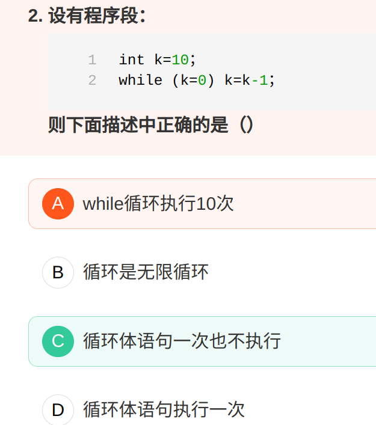
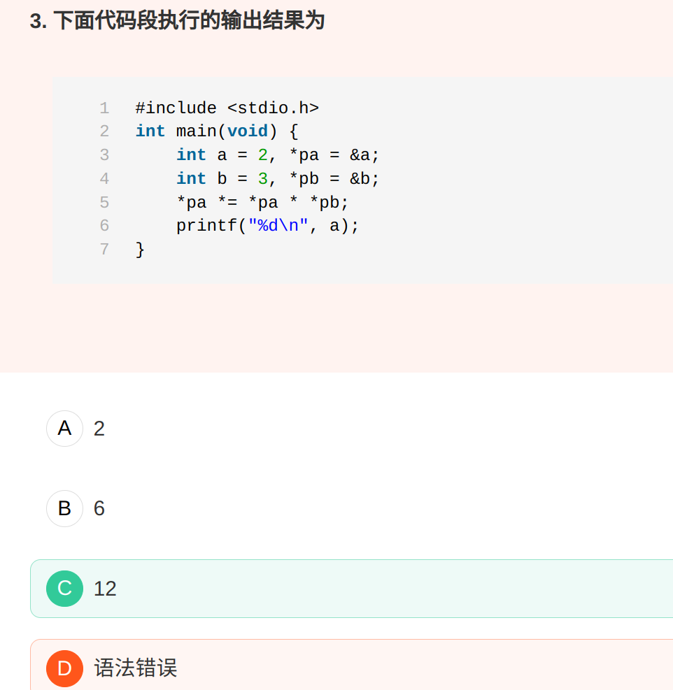
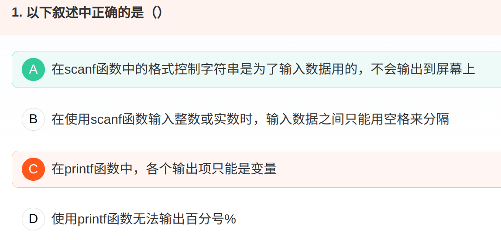
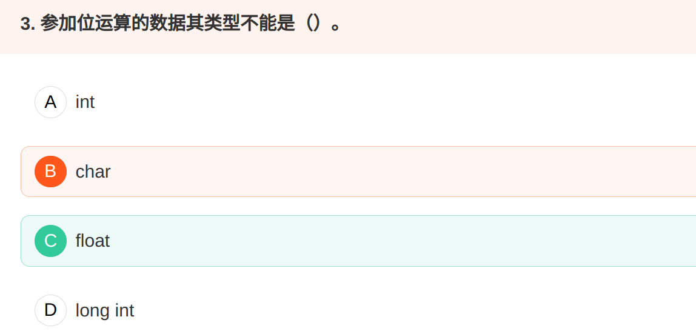
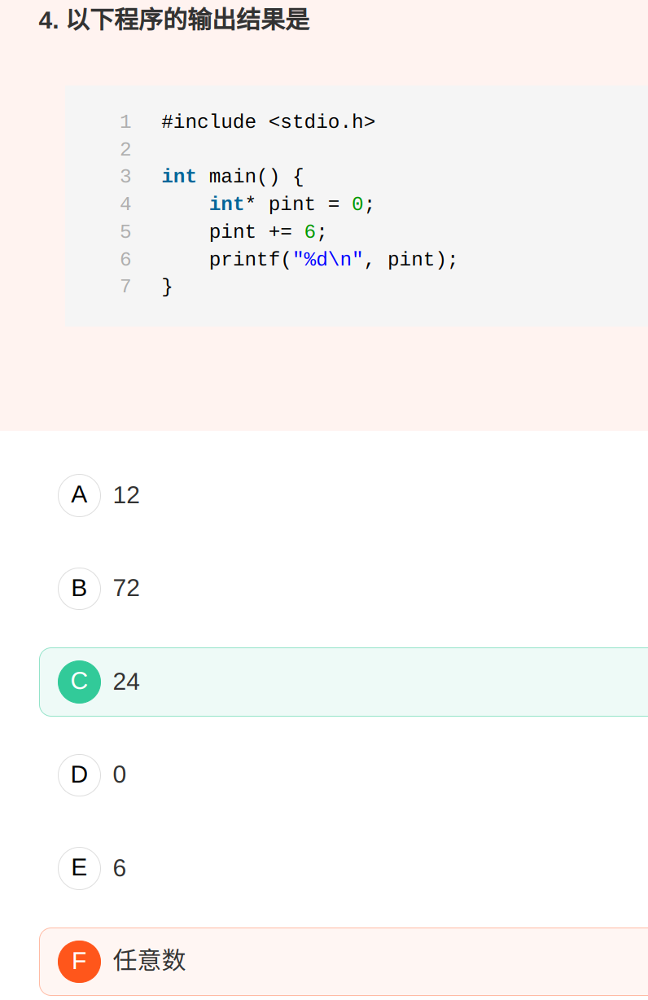
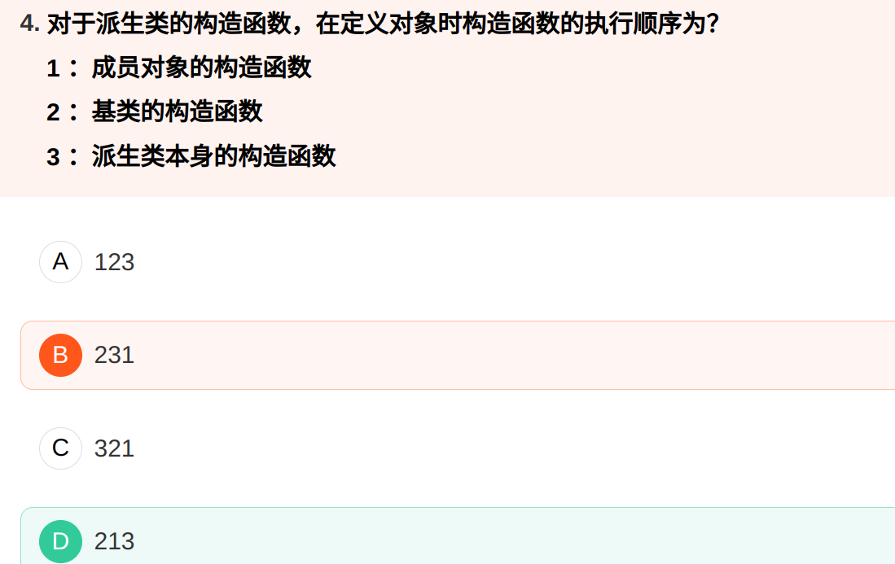
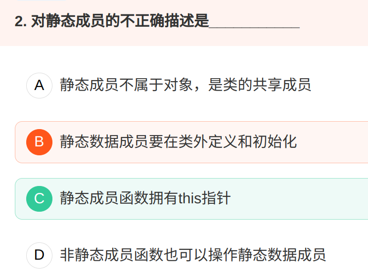
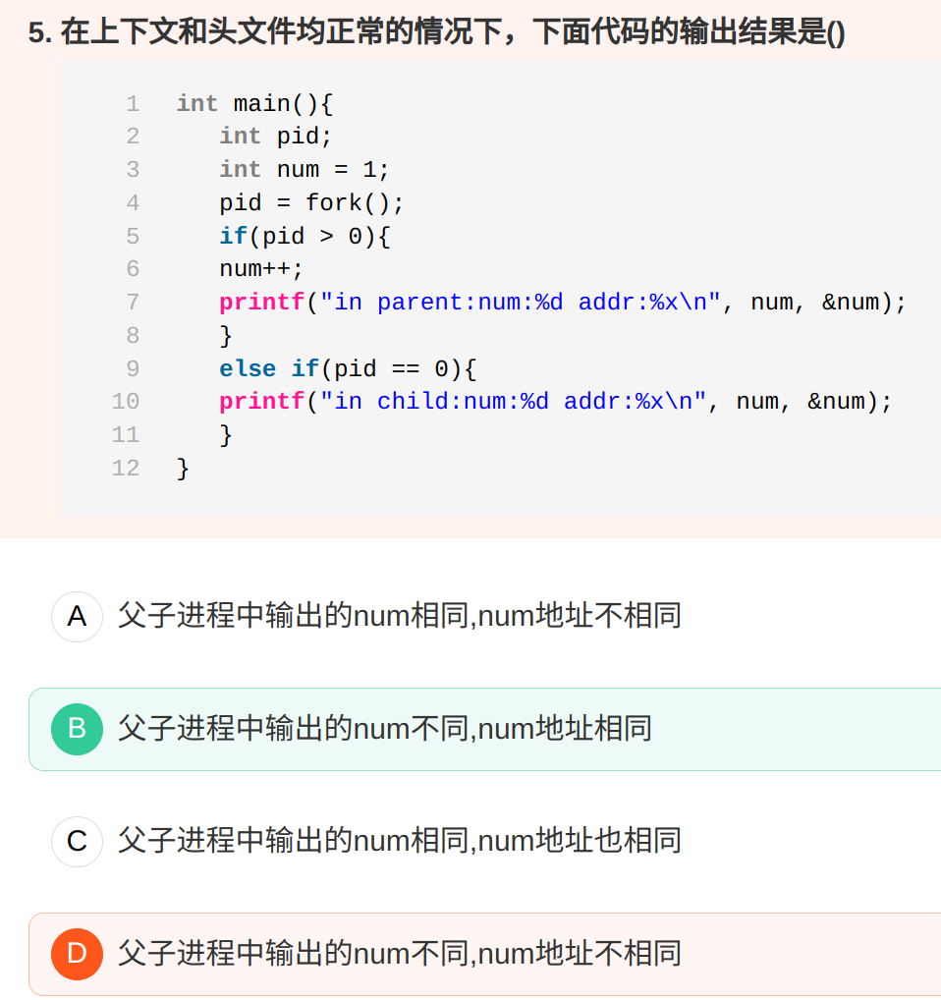

# virtual

```c++
class A
{
public:
    void foo()
    {
        printf("1");
    }
    virtual void fun()
    {
        printf("2");
    }
};
class B: public A
{
public:
    void foo()
    {
        printf("3");
    }
    void fun()
    {
        printf("4");
    }
};
int main(void)
{
    A a;
    B b;
    A *p = &a;
    p->foo();
    p->fun();
    p = &b;
    p->foo();
    p->fun();
    A *ptr = (A *)&b;
    ptr->foo();
        ptr->fun();
    return 0;
}
```

C++Primer Plus(第6版)：P493 有这样一句话：

如果方法是通过引用或者指针而不是对象来调用的，调用规制如下： 

1.如果没有使用关键字virtul，程序将根据引用类型或者指针类型选择方法；

2.如果使用了关键字virtual，程序将根据引用或者指针指向的对象的类型来选择方法

1. C++中含有虚函数的类是可以实例化的，含有纯虚函数的类只能被继承，不能被实例化
2. c++规定，当一个成员函数被声明为虚函数后，其派生类中的同名函数都自动成为虚函数。因此，在子类重新声明该虚函数时，可以加，也可以不加，但习惯上每一层声明函数时都加virtual,使程序更加清晰。   
3. 派生类若函数名、参数与基类都相同，又没有virtual修饰，会触发隐藏。 触发隐藏后，指针的方法调用只取决于指针类型，基类指针调用基类该方法，子类指针调用子类该方法 


# 多态


多态性： 

1. （编译时）静态：函数重载、运算符重载、模板实现 

2. （运行时）动态：虚函数实现

多态有静态多态（编译时）和动态多态（运行时），静态多态主要实现了函数的重载和运算符的重载，动态时的多态主要实现了虚函数 


多态有静态多态（编译时）和动态多态（运行时），静态多态主要实现了函数的重载和运算符的重载，动态时的多态主要实现了虚函数 

函数重载发生在**编译**的时候，它的函数参数是不一样的。而虚函数是发生在**运行**的时候，它的函数原型是一样的，依靠的是指针的指向。


# 程序代码

## 1 



因while后面的表达式是默值表达式，其值为0（即为假），所以循环体内的

语句不可能执行。故正确答案是C。

## 2



解引用“ * ”的优先级比 乘“*” 高；乘“ * ”的优先级比乘后赋值“ *= ”高。
 解引用与乘后赋值的结合性都是从右到左，综上，题干中表达式等价于
 *pa ***=** 2*3;
 *pa **=** (*pa) * 6;
 *pa = 12;

# sizeof


sizeof 是 C 语言中的一个操作符 (operator), 不是函数调用 , 简单的说其作用就是返回一个对象或者类型所占的内存字节数。所以选择 A 。


# 输入输出函数



# 位运算



无论是float  还是double,在内存中的存储分为三部分：符号位，指数位，尾数位；位运算符对它们没有意义

按位运算是对字节或字中的实际位进行检测、设置或移位, 它只适用于字符型和整数型变量以及它们的变体, 对其它数据类型不适用。


# 指针运算




输出的是指针的地址

第一句的意思是将pint指针指向0地址处，由于指针类型是int，每次加1相当于移动四个字节，（在int为四个字节的机器上）；加上6，地址为0x18   

# 构造/析构函数

## 1 析构函数特征


## 2 构造函数执行顺序



在定义派生类的对象时，先调用父类的构造函数，在调用成员的构造函数，最后调用派生类的构造函数。 

  可理解为“先父亲，再客人，最后自己”


# 静态函数



静态数据成员要在类内声明 ，类外定义和初始化

静态成员函数只能访问静态数据成员，但非静态成员函数也可访问静态数据成员 


# 进程



虚拟地址空间。num地址的值相同，但是其真实的物理地址却不一样。 linux下实现了一下，发现地址值真的一样。 fork之后子进程复制了父进程的数据、堆栈。 但是由于地址重定位器之类的魔法存在， 所以，看似一样的地址空间（虚拟地址空间）， 其实却是不同的物理地址空间。 同时可以验证c程序中输出的地址空间其实都是虚拟地址空间。

其实刚刚fork出来不止虚拟地址一样，物理地址也一样。当进程发生分歧时，即修改此变量时，才会分配不同的物理地址，也就是copy-on-write，写时复制。
