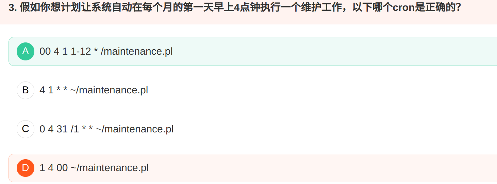

可移植可执行文件（Portable Executable，PE）是一种用于可执行、目标文件和动态链接库的文件格式，主要用于Windows

使用于Linux和多数Unix系统中的是**可执行与可链接格式（ELF）**，Mac OS中则主要使用**Mach-O**；

## 1 firmware

## 2 函数与系统调用

## 3 命令

### exec fg bg jobs

exec    使用vfork函数时，通常需要exec配合使用

fg(Foreground)    将进程搬到前台运行的命令

bg(Background)    将进程搬到后台运行的命令

jobs    查看当前有多少在后台运行的命令

### du df free vmstat

**du**    estimate file space usage:

>  Summarize disk usage of the set of FILEs, recursively for directories.

**df**     report file system disk space usage 

**free** Display amount of free and used memory in the system

**vmstat** Report virtual memory statistics

> vmstat  reports  information about processes, memory, paging, block IO, traps, disks and cpu activity.

###  whereis whatis which apropos

whereis 可查询二进制文件(-b)、帮助文档(-m)、源程序（-s），无选项时，返回所有结果，-u(除上述三种的其它文件) 

  which  查看可执行文件的位置 

  whatis  查询命令有什么功能 

  apropos  搜索指定关键字的命令

## 4 文件内容查看

cat ：由第一行开始显示文件的内容

tac ：（cat倒着写）从最后一行开始显示

nl   ：显示的时候，同时显示行号

more：一页一页的显示文件内容

less   ：与more类似，但是可以往前翻页，man命令参数调用less来显示说明文件内容

head ：只看前面几行

tail    ：只看后面两行

od     ：以二进制的方式读取文件内容

### cat (Concatenate 串联)

**cat [-AbEnTv]**

选项与参数：

-A：相当于 -vET的整合选项

-b：列出非空白行的行号

-E：将结尾的换行符$显示出来

-n：列出包括空白行的行号

-T：将[Tab]键以 ^I 显示出来

-v：列出一些看不见的特殊字符

#### 查看物理内存大小

**cat /proc/meminfo**

/proc：这个目录本身是一个虚拟文件系统，它放置的数据都是在内存中，例如系统内核、进程信息、外接设备的状态及网络状态等。因为这个目录下的数据都是在内存当中，所以本身不战任何硬盘空间。

方式一：**free** 

  直观的展示linux系统内存使用及交换区的容量大小等 

   方式二：**top**  

   动态实时查看系统中每一个进程的资源使用情况  

   方式三：**cat  /proc/meminfo**  

   方式四：**gnome-system-monitor** **一个显示最近一段时间内的****CPU****、内存、交换区及网络使用情况的视图工具。**  

   方式五：**ps aux –sort -rss**  

   各个线程的资源使用情况  

   方式六：**vmstat -s**  

   vmstat命令显示实时的和平均的统计，覆盖CPU、内存、I/O等内容。

### head

**head [-n number] 文件**

选项与参数：

-n 负数, eg：-n -100 代表列出前面所有行数，但不包括后面100行

### tail

**tail [-n number] 文件**

选项与参数：

tail -n +100 文件从100行以后都被列出来

## 5 内核

### 子系统

内核管理进程(进程管理系统)，进程运行在内存(内存管理系统)，内存与外部设备交互经过io子系统(io管理系统)，io的内容来源于文件子系统(文件管理系统) 

### 编译或加载内核

## 6 linux

### 开机启动

以前的厂商启动的模式第一步是BIOS 

现在经过改进后，采取UEFI作为启动的第一步，UEFI 不仅能读取分区表，还能自动支持文件系统。

​		UEFI (Unified Extensible Firmware Interface)是一种用于替代传统BIOS的固件接口标准。UEFI提供了更强大的功能和更高级的安全性，能够支持更大的硬盘容量和更快的启动速度。
 		MBR (Master Boot Record)是存储在硬盘的第一个扇区的引导记录。它包含了引导加载程序和分区表。当计算机启动时，UEFI固件会加载MBR并将控制权传递给引导加载程序。
 		GRUB (Grand Unified Bootloader)是一种常用的引导加载程序，用于在计算机启动时加载操作系统。GRUB能够识别并加载多个操作系统，并提供了一个菜单供用户选择启动哪个操作系统。
 		initrd (initial RAM disk)是一个临时的根文件系统，它被加载到内存中作为启动过程中的初始根文件系统。initrd包含了用于启动操作系统所需的驱动程序、工具和文件系统镜像。
 		所以，当计算机启动时，UEFI固件首先加载MBR，然后将控制权传递给GRUB引导加载程序。GRUB加载initrd作为初始根文件系统，并在其中查找并加载操作系统内核和其他必要的文件。最后，操作系统被加载并启动。

 Linux启动流程： 

  1，BIOS加电自检； 

  2，从硬盘0柱面 0磁道 第一扇区读512字节的MBR主引导记录； 

  3，运行引导程序Grub并根据其配置加载kernel镜像后初始化； 

  4，根据**/etc/inittab(配置文件)**中系统初始化配置执行/etc/rc.sysinit脚本，启动 init 进程

  5，根据第3步读到的runlevel值启动对应服务； 

  6，运行/etc/rc.local; 

  7，生成终端待用户登录

### 定时工作

计划任务内容格式：分 时 日 月 周 命令/脚本 

## 进程 

### fork clone

fork()是全部复制 

vfork()是共享内存 

clone()是可以将父进程资源有选择地复制给子进程，而没有复制的数据结构则通过指针的复制让子进程共享，具体要复制哪些资源给子进程，由参数列表中的clone_flags来决定。另外，clone()返回的是子进程的pid。

## 7 OSI

## 8 vi 编辑器

快捷命令：

dd 删除光标所在的那一整行 

yy 复制光标所在的那一整行 

pp 将已复制的数据在光标的下一行粘贴 

## 9 bash Shell

### 表达式值

0：标准输入 

  1：标准输出 

  2：标准错误输出 

  ">"表示重定向，&2表示标准错误输出的通道，  所以1>&2表示标准输出重定向到标准错误输出通道  ；

  而1>2表示标准输出重定向到文件名为2的文件中

### 查看远程linux系统运行了多长时间

ssh user@被监控主机ip "uptime"

 scp是远程文件传输的命令 ssh user@被监控主机ip "uptime"  是登陆主机后 执行命令。

uptime 命令用于查看服务器运行了多长时间以及有多少个用户登录，快速获知服务器的负荷情况。

