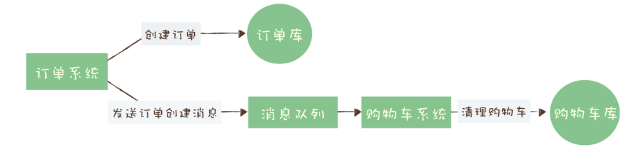
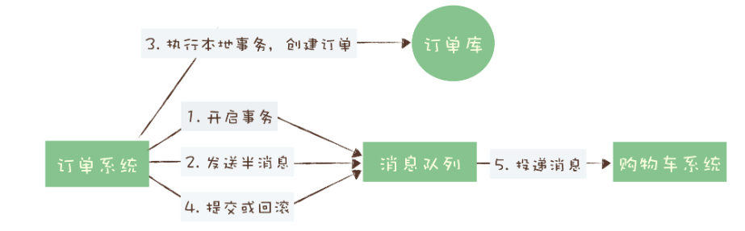
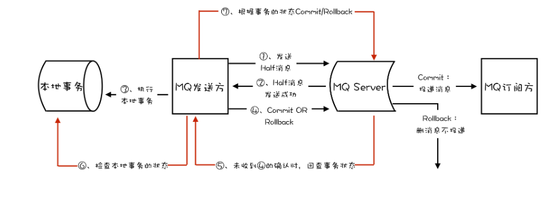

# 1 分布式事务场景

## 1.1事务核心特性

什么是事务？

如果我们对诺干数据进行更新操作，为了保证数据的完整和一致性，我们希望这些操作要么都成功，要么都失败。

一个严格的事务实现，应该具有四个属性：ACID四大特性

Atomicty（原子性）：一个事务不可分割，要么都成功，要么都失败。

Consistency（一致性）：指数据在事务之前完成之前，读到的一定是更新前的数据，之后一定读到的是更新后的数据，不应该存在某一时刻，让用户读到更新过程中的数据。

Isolation（隔离性）：多个事务并发执行过程中互不干扰。

Durability（持久性）：事务提交后，变更永久生效。

当事务的影响范围局限在一个关系型数据库中，很多时候上述四项特性时能够实现的，但是倘若事务涉及的修改范围是跨数据库甚至跨服务跨存储组件时，就不一定能实现了，也就是“分布式事务”领域

分布式事务就是要在分布式系统中的实现事务。在分布式系统中，在保证可用性和不严重牺牲性能的前提下，光是要实现数据的一致性就已经非常困难了，所以出现了很多“残血版”的一致性，比如顺序一致性、最终一致性等等。

显然实现严格的分布式事务是更加不可能完成的任务。所以，目前大家所说的分布式事务，更多情况下，是在分布式系统中事务的不完整实现。在不同的应用场景中，有不同的实现，目的都是通过一些妥协来解决实际问题。

在实际应用中，比较常见的分布式事务实现有 2PC（Two-phase Commit，也叫二阶段提交）、TCC(Try-Confirm-Cancel) 和事务消息。每一种实现都有其特定的使用场景，也有各自的问题，都不是完美的解决方案。

事务消息适用的场景主要是那些需要异步更新数据，并且对数据实时性要求不太高的场景。比如我们在开始时提到的那个例子，在创建订单后，如果出现短暂的几秒，购物车里的商品没有被及时清空，也不是完全不可接受的，只要最终购物车的数据和订单数据保持一致就可以了。

2PC 和 TCC 不是我们本次课程讨论的内容，就不展开讲了，感兴趣的同学可以自行学习。

## 1.2 分布式事务场景问题

### 例一

假设我们在维护一个电商后台系统，每当处理一笔来自用户创建订单的请求时，需要执行两步操作：

1. 从账户系统中，扣减用户的账户余额

2. 从库存系统中，扣减商品的剩余库存

 从业务流程上说，这个流程需要保证事务的原子性，即两个操作需要能一起完成，要么都成功，要么都失败。

但从技术流程上说，两个步骤时相对独立的两个操作，底层涉及到的存储介质也是相互独立的，因此无法基于本地事务的实现方式。

### 例二

用户在电商APP上购物，先把商品加到购物车里，然后几件商品一起下单，最后支付，完成购物。

这个过程中有一个需要用到消息队列的步骤，订单系统创建订单后，发消息给购物车系统，将已下单的商品从购物车中删除。因为从购物车删除已下单商品这个步骤，并不是用户下单支付这个主要流程中必需的步骤，使用消息队列来异步清理购物车是更加合理的设计。

对订单系统而言，它创建订单的过程实际上执行了2个步骤的操作：

1. 在订单库中插入一条订单数据，创建订单
2. 发消息给消息队列，消息的内容就是刚刚创建的订单

购物车系统订阅相应的主题，接收订单创建的消息。然后清理购物车，在购物车中删除订单中的商品。

在分布式系统中，上面提到的这些步骤，任何一个步骤都有可能失败，如果不做任何处理，那就有可能出现订单数据与购物车数据不一致的情况，比如说：

- 创建了订单，没有清理购物车；
- 订单没创建成功，购物车里面的商品却被清掉了。

那么我们需要解决的问题就是在上述任意步骤都有可能失败的情况下，还要保证订单库和购物车这两个库的数据一致性。

对于购物车系统收到订单创建成功消息后成功清理购物车，购物车清理失败的操作很简单，在清理成功后在提交消费确认后即可，如果失败，由于没有提交消费确认，消息队列会自动重试。

问题的关键集中在订单系统，创建订单和发送消息这两个步骤要么都成功，要么都失败。

这就是事务需要解决的问题。

### 1.3 消息队列是如何实现分布式事务的？

事务消息需要消息队列提供相应的功能才能实现，kafka和RocketMQ都提供了事务相关功能。

回到订单和购物车这个例子，我们一起来看下如何用消息队列来实现分布式事务。

前面提到，问题的关键是订单系统。创建订单和发送消息这两个步骤要么都成功，要么都失败。

首先订单系统在消息队列上开启一个事务。然后订单系统给消息服务器发送一个“半消息”

> 这个半消息不是说消息内容不完整，它包含的内容就是完整的消息内容，半消息和普通消息的唯一区别是，在事务提交之前，对于消费者来说，这个消息是不可见的。

半消息发送成功后，订单系统就可以执行本地事务了，在订单库中创建一条订单记录，并提交订单库的数据库事务。然后根据本地事务的执行结果决定提交或者回滚事务消息。

如果订单创建成功，那就提交事务消息，购物车系统就可以消费到这条消息继续后续的流程。如果订单创建失败，那就回滚事务消息，购物车系统就不会收到这条消息。这样就基本实现了“要么都成功，要么都失败”的一致性要求。

如果你足够细心，可能已经发现了，这个实现过程中，有一个问题是没有解决的。如果在第四步提交事务消息时失败了怎么办？对于这个问题，Kafka 和 RocketMQ 给出了 2 种不同的解决方案。

Kafka 的解决方案比较简单粗暴，直接抛出异常，让用户自行处理。我们可以在业务代码中反复重试提交，直到提交成功，或者删除之前创建的订单进行补偿。RocketMQ 则给出了另外一种解决方案。

## 1.4 RocketMQ中的分布式事务实现

在 RocketMQ 中的事务实现中，增加了事务反查的机制来解决**事务消息提交失败**的问题。如果Producer订单系统，在提交或者回滚事务消息时发生网络异常，Broker没有收到提交或者回滚的请求，Broker就会定期去Producer上反查这个事务对应的本地事务的状态，然后根据反差结果决定提交或者回滚这个事务。

为了支撑事务反查机制，我们的业务代码需要实现一个反查本地事务状态的接口，查到上次提交或者回滚的结果，告知 RocketMQ本地事务是成功还是失败。

反查事务逻辑：根据订单id，查询数据库中是否有这条订单数据，如果存在则返回成功，否则返回失败。RocketMQ 会自动根据事务反查的结果提交或者回滚事务消息。

这个反查本地事务的实现，并不依赖消息的发送方，也就是订单服务的某个实例节点上的任何数据。这种情况下，即使是发送事务消息的那个订单服务节点宕机了，RocketMQ 依然可以通过其他订单服务的节点来执行反查，确保事务的完整性。

