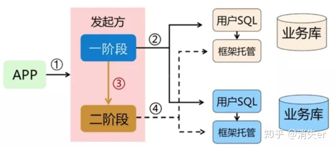
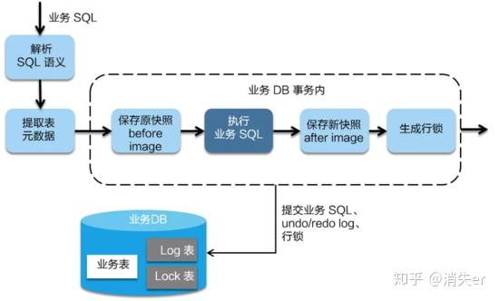
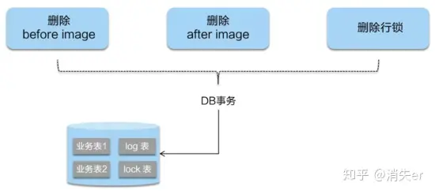
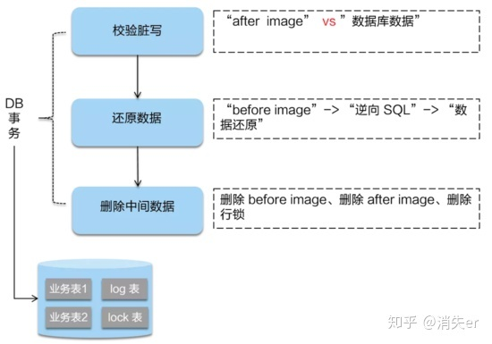
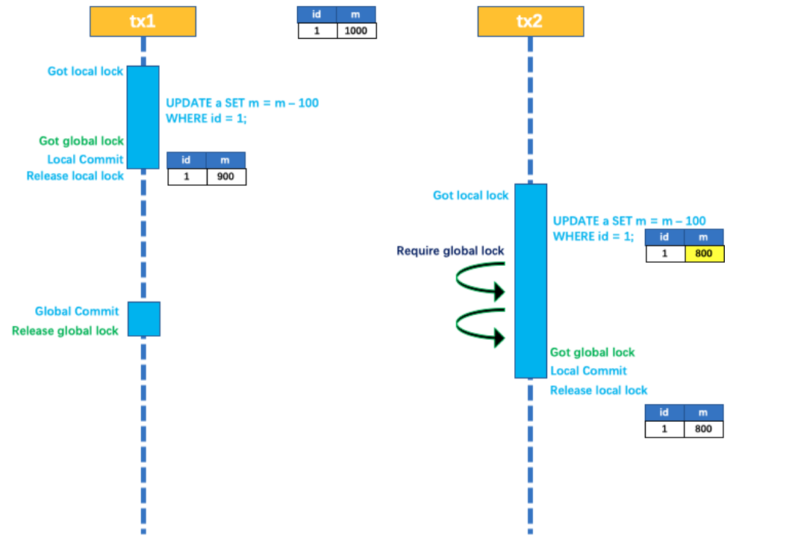
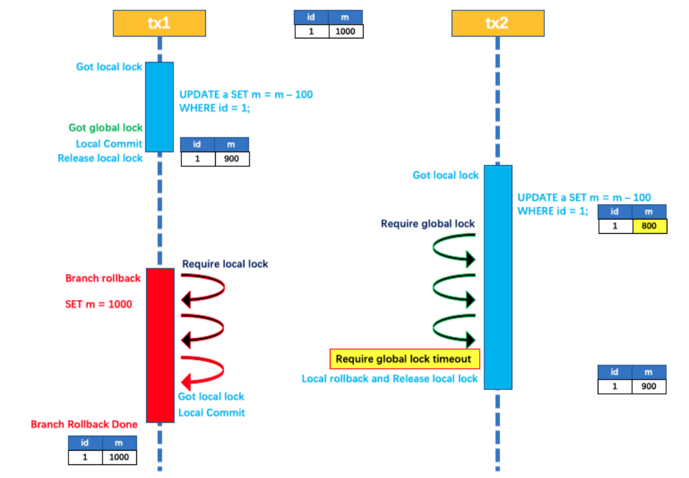
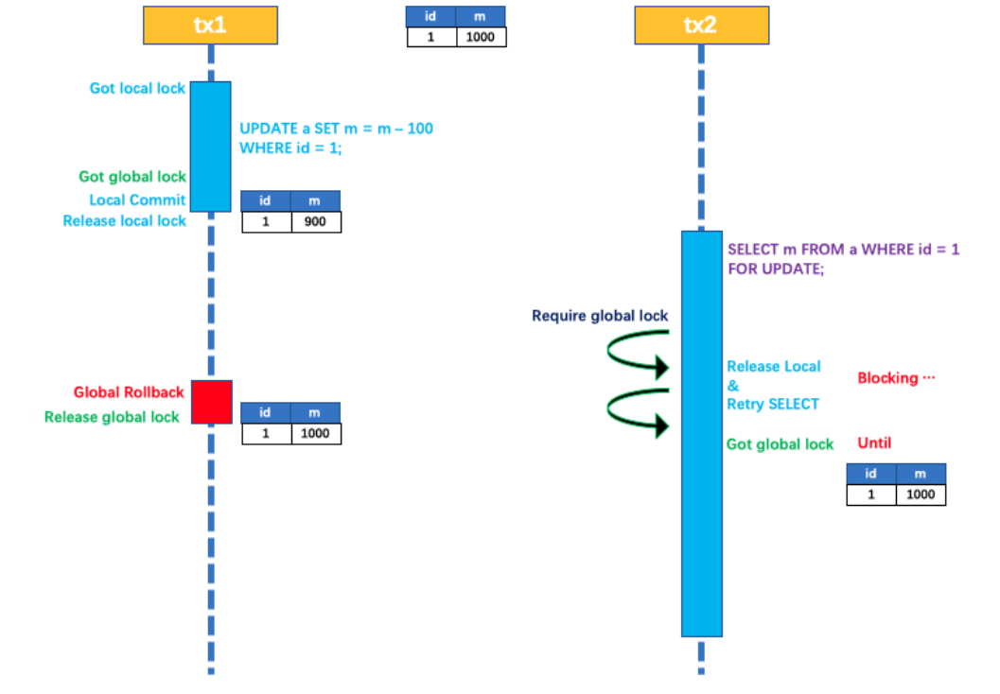

[TOC]

# 简要介绍什么是分布式事务以及它的主要作用是什么？

分布式事务指的是在分布式环境中的事务处理，需要保证数据的ACID

 

# 请描述两阶段提交（2PC）协议的基本过程，以及他在分布式事务中的应用

知乎（内含论文链接）：https://zhuanlan.zhihu.com/p/35298019

论文：https://www.the-paper-trail.org/post/2008-11-27-consensus-protocols-two-phase-commit/

 

两个阶段，第一阶段：投票阶段，第二阶段：提交/执行阶段

协议中有两类节点，协调者和N个参与者

举例：https://www.cnblogs.com/qdhxhz/p/11167025.html

 

# 2PC协议缺陷和解决方案。

https://www.cnblogs.com/qdhxhz/p/11167025.html

1） 性能问题

无论是第一阶段还是第二阶段，协调者和参与者的资源都上锁，直到节点准备完毕，协调者才会通知全面提交，参与者进行本地提交后才会释放资源，对性能影响比较大。

2） 单节点故障

（1） 协调者正常，参与者宕机

协调者无法收到参与者的反馈，就会一直堵塞下去。

解决方案：协调者引入超时时间

（2） 协调者宕机，参与者正常

解决方案：协调者备份

（3） 都宕机

有几种情况，在不同阶段宕机处理方法不同。

a. 在第一阶段，所有参与者都没有commit。解决方法：在剩余的参与者中选出一个协调者，新的协调者重新执行第一阶段和第二阶段。

b. 发生在第二阶段，并且挂了的参与者在挂之前没有收到协调者的指令。也就是协调者根据参与者回复的是否全是yes发出指令commit，不全是，发指令rollback的步骤。这种情形下，协调者重新执行第一二阶段操作。

c. 发生在第二阶段，且有部分参与者已经执行完了commit操作。比如参与者A、B都受到了协调者的commit指令，A执行成功了，B挂了，这时候数据就是不一致的了。虽然这个时候可以再通过手段让他和协调者通信，再想办法把数据搞成一致的，但是，这段时间内他的数据状态已经是不一致的了！ 2PC 无法解决这个问题。

# 3PC协议在2PC基础上进行了那些优化？

3PC为了解决两阶段协议的阻塞问题，2pc存在的问题是当协作者崩溃时，参与者不能做出最后的选择。因此参与者可能在协作者恢复之前保持阻塞。三阶段提交（Three-phase commit），是二阶段提交（2PC）的改进版本。

与两阶段提交不同的是，三阶段提交有两个改动点。

（1） 同时在参与者与协调者之间引入了超时机制，2PC只有协调者有。

（2） 在第一阶段和第二阶段之间插入一个准备阶段，即三个阶段：CanCommit、PreCommit、DoCommit

1. CanCommit阶段

协调者发送commit请求给参与者，参与者根据情况返回yes or no。

2. PreCommit 阶段

协调者根据参与者的反应来决定是否可以继续事务的PreCommit操作。根据相应情况，有三种可能。都是yes或者有任何一个参与者发送了no，或者等待超时。

3. DoCommit 阶段

进行真正的事务提交，分为两中情况。执行提交或者中断事务。

# 请描述AT模式的基本过程，以及它在分布式事务中的应用

官网：https://seata.io/zh-cn/docs/dev/mode/at-mode.html

 知乎： https://zhuanlan.zhihu.com/p/78599954

常见的分布式事务解决方案：

1. Seata阿里分布式事务框架 模式：AT
2. 消息队列         模式：TCC
3. Saga          模式：Saga
4. XA           模式：XA

他们有一个共同的特点，就是两阶段。两阶段是指完成整个分布式事务，划分为两个步骤完成。

实际上，这四种常见的分布式事务解决方案，分别对应着分布式事务的四种模式：AT、TCC、Saga、XA；

四种分布式事务模式，都有各自的理论基础，分别在不同的时间被提出；每种模式都有它的适用场景，同样每个模式也都诞生有各自的代表产品；而这些代表产品，可能就是我们常见的(全局事务、基于可靠消息、最大努力通知、TCC)。

## AT (Automatic Transaction自动补偿型事务)模式

二阶段提交协议

主要特点：在事务过程中引入了补偿操作，以解决传统2PC中的 某些问题。

使用“业务补偿”的方法，对事物过程进行改进。在AT模式下，分布式系统中的每一个参与者都会在完成了本事务后，生成一个补偿操作。补偿操作用于在事务失败时，将已完成的事物回滚到之前的状态。通过这种方式，确保了一致性，同时避免了传统2PC的阻塞问题。

AT模式中，全局事务协调者负责管理和协调分布式事务，参与者负责执行本地事务并向协调者报告其执行结果。

AT模式执行过程

整体机制：

两阶段提交协议的演变

一阶段：业务数据和回滚日志记录在同一个本地事务中提交，释放本地锁和连接资源

二阶段：（1）提交异步化，非常快速的完成

​	            （2）回滚通过一阶段的回滚日志进行反向补偿

1. 尝试阶段

协调者向所有参与者发送分布式事务的开始请求，参与者收到请求后会执行分布式事务，并将结果返回给协调者。此时，参与者不会立即提交事务，而是等待协调者的确认。

AT模式是一种无侵入的分布式事务解决方案。在AT模式下，用户只需要关注自己的“业务SQL”，用户的“业务SQL”作为一阶段，Seata框架会自动生成事务的二阶段提交和回滚操作。

AT模式如何做到对业务的无侵入？

在一阶段，Seata会拦截“业务SQL”，首先解析SQL语句，找到“业务SQL“要更新的数据，在业务数据更新前，将其保存成“before image”，然后执行”业务SQL”更新业务数据，在业务数据更新后，再将其保存成“after image“， 最后生成行锁。以上操作全在一个数据库事务内完成，这样保证了一阶段的原子性。

2. 二阶段（两种情况）

二阶段提交：

因为在第一阶段已经提交至数据库，所以Seata框架只需要将第一阶段保存的快照和行锁删掉，完成数据清理即可。

 

 

二阶段回滚：

出现脏写转人工处理

 

 

## 写隔离

一阶段提交前需要拿到全局锁，拿不到就不能提交本地事务。

拿到全局锁的尝试被限制在一定的范围，超出了就放弃，并回滚本地事务，释放本地锁。

示例：

两个全局事务 tx1 和 tx2，分别对 a 表的 m 字段进行更新操作，m 的初始值 1000。

tx1 先开始，开启本地事务，拿到本地锁，更新操作 m = 1000 - 100 = 900。本地事务提交前，先拿到该记录的 **全局锁** ，本地提交释放本地锁。 tx2 后开始，开启本地事务，拿到本地锁，更新操作 m = 900 - 100 = 800。本地事务提交前，尝试拿该记录的 **全局锁** ，tx1 全局提交前，该记录的全局锁被 tx1 持有，tx2 需要重试等待 **全局锁** 。

tx1 二阶段全局提交，释放 **全局锁** 。tx2 拿到 **全局锁** 提交本地事务。

如果tx1 的二阶段全局回滚，则tx1需要重新获取该数据的本地锁，进行反向补偿操作，实现分支的回滚。

此时，如果tx2在等待全局锁，同时持有本地锁，则tx1的回滚就会失败。分支回滚会一直尝试，直到tx2的全局锁等待超时，放弃全局锁并回滚本地事务，释放本地锁，tx1获取到了本地锁，最后tx1的分支回滚才会成功。

因为整个过程 **全局锁** 在 tx1 结束前一直是被 tx1 持有的，所以不会发生 **脏写** 的问题。

## 读隔离

在数据库本地事务隔离级别**读已提交**或以上的基础上，Seata AT模式的默认全局隔离级别是 **读未提交** 。

如果应用在特定的场景下，必须要求全局的**读已提交**，目前 Seata 的方式是通过 SELECT FOR UPDATE 语句的代理。 

SELECT FOR UPDATE 语句的执行会申请 **全局锁** ，如果 **全局锁** 被其他事务持有，则释放本地锁（回滚 SELECT FOR UPDATE 语句的本地执行）并重试。这个过程中，查询是被 block 住的，直到 **全局锁** 拿到，即读取的相关数据是 **已提交** 的，才返回。

出于总体性能上的考虑，Seata 目前的方案并没有对所有 SELECT 语句都进行代理，仅针对 FOR UPDATE 的 SELECT 语句。

# 说说了解的TCC协议，以及他在分布式事务中的应用

 *TCC*（Try-Confirm-Cancel）

