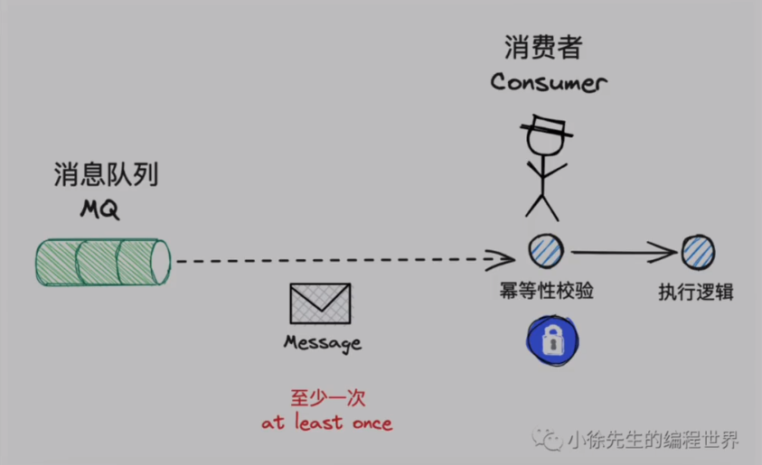

# 1 事务消息方案

 其中，一类偏狭义的分布式事务解决方案是基于消息队列MessageQueue（MQ）实现的事务消息Transaction Message

## 1.1 RocketMQ简介

github仓库：https://github.com/apache/rocketmq

官方文档 - 事务消息：https://rocketmq.apache.org/docs/4.x/producer/06message5

RocketMQ 是阿里巴巴在 2012 年开源的消息队列产品，后来捐赠给 Apache 软件基金会，2017 正式毕业，成为 Apache 的顶级项目。阿里内部也是使用 RocketMQ 作为支撑其业务的消息队列，经历过多次“双十一”考验，它的性能、稳定性和可靠性都是值得信赖的。作为优秀的国产消息队列，近年来越来越多的被国内众多大厂使用。

RocketMQ 有非常活跃的中文社区，大多数问题你都可以找到中文的答案，也许会成为你选择它的一个原因。另外，RocketMQ 使用 Java 语言开发，它的贡献者大多数都是中国人，源代码相对也比较容易读懂，你很容易对 RocketMQ 进行扩展或者二次开发。

RocketMQ 对在线业务的响应时延做了很多的优化，大多数情况下可以做到毫秒级的响应，**如果你的应用场景很在意响应时延，那应该选择使用 RocketMQ。**

RocketMQ 的性能比 RabbitMQ 要高一个数量级，每秒钟大概能处理几十万条消息。

RocketMQ 的一个劣势是，作为国产的消息队列，相比国外的比较流行的同类产品，在国际上还没有那么流行，与周边生态系统的集成和兼容程度要略逊一筹。

## 1.2 基于MQ实现分布式事务

MQ组件，通常能保证的是：投递到 MQ 中的消息至少能被下游消费者 consumer 消费到一次，即 at least once 语义。

基于此，MQ 组件能够保证消息不会在消费环节丢失，但是无法解决消息的重复性问题。因此，唐诺我们需要追求精确消费一次的目标，则下游的consumer还需要基于消息的唯一键执行幂等去重操作，在 at least once 的基础上过滤掉重复消息，最终达到 exactly once 的语义。

