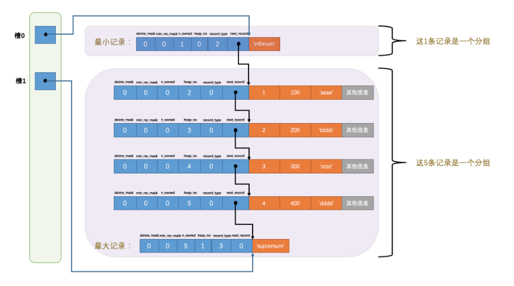

# 3 字符集和比较规则

## 3.1 简介

### 3.1.1 字符集简介

计算机只能存储二进制，那怎样存储字符串呢？通过建立字符与二进制数据的映射关系。

要把那些字符应射程二进制数据？也就是界定字符范围

编码：字符 -> 二进制数据

解码：二进制数据 -> 字符

怎么映射？人们抽象出一个 字符集 概念来描述某个字符范围的编码规则

### 3.1.2 比较规则简介

比较两个字符的大小：比较二进制编码大小

但对于不区分大小写的情况，就全转大写or小写

### 3.1.3 很多字符集

## 3.2 MySQL中支持的字符集和排序规则

### 3.2.1 MySQL中的utf8和utf8mb4

utf8 字符集表示一个字符需要使用1～4个字节，但是我们常用的一些字符使用1～3个字节就可以表
示了。而在 MySQL 中字符集表示一个字符所用最大字节长度在某些方面会影响系统的存储和性能，所以设计
MySQL 的大叔偷偷的定义了两个概念：
utf8mb3 ：阉割过的 utf8 字符集，只使用1～3个字节表示字符。
utf8mb4 ：正宗的 utf8 字符集，使用1～4个字节表示字符。

### 3.2.2 字符集查看

SHOW (CHARACTER SET|CHARSET) [LIKE 匹配的模式];

Maxlen ，它代表该种字符集表示一个字符最多需要几个字节。

### 3.2.3 比较规则查看

SHOW COLLATION [LIKE 匹配的模式];

## 3.3 字符集和比较规则的应用

MySQL 有4个级别的字符集和比较规则，分别是：
服务器级别
数据库级别
表级别
列级别

# 4 Inno 记录结构

## 4.2 Inno 页简介

InnoDB：将数据存储到磁盘上的存储引擎，因为与磁盘打交道，所以需要优化查询速度，选择效率最高的存储结构，B+树

而B+树中每一个节点存储的是数据页，数据库的IO操作最小单位是页，InnoDB数据页的默认大小是16KB。

## 4.3 InnoDB 行格式

平时以记录为单位向表中插入数据，记录在磁盘上的存放方式也被称为行格式或者记录格式

### 4.3.2 COMPACT

#### 4.3.2.1 记录的额外信息

服务器为了描述这条记录而不得不添加的一些信息

#### 4.3.2.2 记录的真实数据

隐藏列（行ID、事务ID和回滚指针）+真实数据

4.3.3 Redundant行格式

### 4.3.4 行溢出数据

#### 4.3.4.1 VARCHAR(M)最多能存储的数据

真实数据
真实数据占用字节的长度
NULL 值标识，如果该列有 NOT NULL 属性则可以没有这部分存储空间

#### 4.3.4.2 记录中的数据太多产生的溢出

超出一页，存放至多个页，并记录溢出页地址

#### 4.3.4.3 行溢出的临界点

MYSQL中规定，一页中至少存放两行记录

额外信息+2*（每条记录的额外信息27字节 + 一个列中存储的数据字节数）

### 4.3.5 Dynamic和Compressed行格式

#  5 InnoDB数据页结构

## 5.1 不同类型的页简介

页是InnoDB管理存储空间的基本单位，一个页的大小一般是16KB

有不同的页类型，存储记录的称为索引页，也可称为数据页

## 5.2 数据页结构的快速浏览

## 5.3 记录在页中的存储

user recodes部分是从free space中划分出来

### 5.3.1 记录头信息的秘密

next_record:表示从当前记录的真实数据到以下一条记录的真实数据的地址偏移量，类似链表

将这个delete_mask位设置为1和将被删除的记录加入到垃圾链表中其实是两个阶段，我们后边在
介绍事务的时候会详细唠叨删除操作的详细过程

## 5.4 Page Directory（页目录）

制作过程：

1. 类似书的目录，将所有正常记录划分为几个组，
2. 每组的最后一条记录（组内最大的那条记录）的头信息中的n_owned属性表示该记录拥有多少条记录，也就是该组内拥有几条记录。
3. 将每个组最后一条记录的地址偏移量单独提取出来按顺序存储到靠近页尾部的地方。，这就是页目录。页目录中的这些地址偏移量被称为槽，所以页面目录就是由槽组成的。

为什么最小记录的 n_owned 值为1，而最大记录的 n_owned 值为 5 呢?

规定：对于最小记录所在的分组只能有 1 条记录，最大记录所在的分组拥有的记录条数只能在 1~8 条之间，剩下的分组中记录的条数范围只能在是 4~8 条之间。

分组的步骤：

1. 初始情况下一个数据页里只有最小记录和最大记录两条记录，他们属于两个分组。
2. 之后每插入一条记录，都会从

## 5.5 Page Header（页面头部）

得到一个数据页中存储的记录的状态信息，比如本页存储了多少条记录。第一条记录的地址是什么。

特地定义了Page Header，它是页结构的第二部分，固定占用56字节，专门存储各种状态信息

## 5.6 File Header（文件头部）

对各类型的页都通用，所以存放的是各种页都通用的一些信息，固定占用38字节

|         类型名称         | 十六进制 |              描述               |
| :----------------------: | :------: | :-----------------------------: |
| FIL_PAGE_SPACE_OR_CHKSUM |          |             校验和              |
|     FIL_PAGE_OFFSET      |          |       每个页有单独的页号        |
|      FIL_PAGE_TYPE       |          |             页类型              |
|      FIL_PAGE_PREV       |          |            双向链表             |
|      FIL_PAGE_NEXT       |          |                                 |
| FIL_PAGE_TYPE_ALLOCATED  |  0x0000  |       最新分配，还没使用        |
|    FIL_PAGE_UNDO_LOG     |  0x0002  |           Undo日志页            |
|      FIL_PAGE_INODE      |  0x0003  |           段信息节点            |
| FIL_PAGE_IBUF_FREE_LIST  |  0x0004  |      nsert Buffer空闲列表       |
|   FIL_PAGE_IBUF_BITMAP   |  0x0005  |        nsert Buffer位图         |
|    FIL_PAGE_TYPE_SYS     |  0x0006  |             系统页              |
|  FIL_PAGE_TYPE_TRX_SYS   |  0x0007  |          事务系统数据           |
|  FIL_PAGE_TYPE_FSP_HDR   |  0x0008  |         表空间头部信息          |
|    FIL_PAGE_TYPE_XDES    |  0x0009  |           扩展描述页            |
|    FIL_PAGE_TYPE_BLOB    |  0x000A  |             BLOB页              |
|      FIL_PAGE_INDEX      |  0x45BF  | 索引页，也就是我们所说的 数据页 |

## 5.7 File Trailer

为了检查一个页是否完整

InnoDB存储引擎将数据存储到磁盘上，但是磁盘速度太慢，需要以页为单位把数据加载到内存中处理，如果该页中的数据在内存中被修改了，那么在修改后的某个时间需要把数据同步到磁盘中，如果在同步到一半断电了应该怎么办？

这时候就需要检查一个页是否完整，需要用到

## 5.8 总结

# 6 B+树索引

## 6.1 没有索引的查找

### 6.1.1 在一个页中的查找

根据搜索条件的不同，

以主键为搜索条件

以其他列

### 6.1.2 在很多页中的查找

## 6.2 索引

### 6.2.1 一个简单的索引方案

下一页数据页中记录的主键值必须大于上一个页用户记录的主键值，这个过程称之为页分裂

因为数据页物理上可能并不挨着，所以如果想快速定位，需要做个目录，一个目录项包括两部分，

key：页的用户记录中最小的主键值

page_no：页号

上边之所以称为一个简易的索引方案，是因为我们为了在根据主键值进行查找时使用二分法快速定位具体的目录项而假设所有目录项都可以在物理存储器上连续存储，但实际上是不太可能的，InnoDB最多能保证一页，也就是16KB的连续存储空间。

我们时常会对记录进行增删，假设我们把 页28 中的记录都删除了， 页28 也就没有存在的必要了，那意味着 目录项2 也就没有存在的必要了，这就需要把 目录项2 后的目录项都向前移动一下，这种牵一发而动全身的设计不是什么好主意

### 6.2.2 InnoDB 中的索引方案

复用数据页来存储目录项。 记录头信息里的record_type 属性

它的各个取值代表的意思如下：
0 ：普通的用户记录
1 ：目录项记录
2 ：最小记录
3 ：最大记录

B+树：不论是存放用户记录的数据页，还是存放目录项纪录的数据页，我们都把他们放到B+树的数据结构中了。所以也称数据页为节点

**目录项纪录和普通用户记录的不同点：**

1. 目录项纪录的record_type值为1，普通用户为0
2. 目录项纪录只有主键值和页的编号两个列，二普通户用记录的列使用户自己定义的，肯呢个包含很多列，另外还有InnoDB自己添加的隐藏列
3. 在存储目录项纪录的页中的主键指最小的目录项纪录的min_rec_mask值为1,其他别的为0

