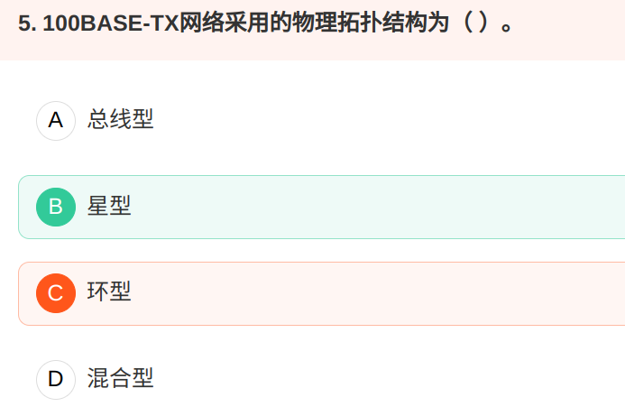

# 概念题

## 协议

### TCP UDP

**UDP 协议头**助记：“半源半目半包长，半校验”。 协议头的一个单位长度是四字节，半源是指半个单位长度（即2字节）的源端口，半目是指半个单位长度（即2字节）的目的端口，半包长是指半个单位长度（即2字节）的包长度，半校验是指半个单位长度（即2字节）的校验和

UDP头部信息只有4个，  

  从哪来：源端口 

  到哪去：目的端口 

  有多长：长度 

  对不对：校验和

UDP跟TCP不一样，UDP是一种本身不可靠的传输协议，它的可靠性只能通过应用程序来确保

#### 窗口大小

 **滑动窗口协议**，是TCP使用的一种流量控制方法。该协议允许发送方在停止并等待确认前可以连续发送多个分组。由于发送方不必每发一个分组就停下来等待确认，因此该协议可以加速数据的传输。 

​    **自动重传请求**（Automatic Repeat-reQuest，**ARQ**）是OSI模型中数据链路层的错误纠正协议之一。它通过使用确认和超时这两个机制，在不可靠服务的基础上实现可靠的信息传输。如果发送方在发送后一段时间之内没有收到确认帧，它通常会重新发送。ARQ可能包括停止等待ARQ协议、回退ARQ和连续ARQ协议，错误检测（Error Detection）、正面确认（Positive Acknowledgment）、超时重传（Retransmission after Timeout）和 负面确认及重传（Negative Acknowledgment and Retransmission）等机制。

### IP

IP报文头的TTL字段，最大值是255, 只有经过路由器才减1，集线器和交换机不会。

主机地址全0不是有效的主机地址，是网络地址。

 **A类地址中的私有地址和保留地址：** 

  ①10.0.0.0到10.255.255.255是私有地址（所谓的私有地址就是在互联网上不使用，而被用在局域网络中的地址）。 

   ② 127.0.0.0到127.255.255.255是保留地址，用做循环测试用的。 

 **B类地址的私有地址和保留地址**    

​    ① 172.16.0.0到172.31.255.255是私有地址   

​    ②169.254.0.0到169.254.255.255是保留地址。

  **C类地址中的私有地址：**

  192.168.0.0到192.168.255.255是私有地址 

### X.25协议

X.25协议是数据终端设备（DTE）和数据电路终接设备（DCE）之间的接口规程。

### ARP协议

地址解析协议，即ARP（Address Resolution Protocol），是根据 **IP地址**获取**物理地址**的一个 [TCP/IP协议](http://baike.baidu.com/view/7649.htm) 。

 [主机](http://baike.baidu.com/view/23880.htm) 发送信息时将包含 目标IP地址 的 ARP请求广播（**broadcast**） 到网络上的所有主机，并接收返回消息，以此确定目标的物理地址；

收到返回消息后将该IP地址和物理地址存入本机ARP缓存中并保留一定时间，下次请求时直接查询ARP缓存以节约资源。

unicast应是单播，broadcast是广播，multicast应该是多播。 

### 端口号

### Ipv4 Ipv6

### MAC地址

Media Access Control Address，直译为：媒体存取控制位址，也称为局域网地址，以太网地址或物理地址，它是一个用来确认网路设备位置的位址。

在OSI模型中，第三层网络层负责IP地址，第二层数据链路层负责MAC地址。MAC地址用于在网络中标识一个网卡，一台设备若有一个或多个网卡，则每个网卡都会需要一个MAC地址。

MAC地址长度：48比特（6个位元组），以十六进位表示

### FTP

文件传输协议

FTP是文件传输协议的缩写，包含了两个通道，一个叫控制通道，一个叫数据通道。 

控制通道：控制通道是和FTP服务器进行沟通的通道，连接FTP，发送FTP指令都是通过控制通道来完成的。 

数据通道：数据通道是和FTP服务器进行文件传输或者列表的通道。  

大家可能会问，为什么FTP协议需要两个通道呢？ 我举一个简单的例子，当我们用FTP客户端比如FTPRush下载FTP上的文件的时候，通常会加入好几个目录和文件到队列窗口，那么当下载开始的时候，队列里面的第二个文件怎么知道该被传输呢？

这就是控制通道的用处了，当下载文件的时候，FTP客户端会 等待FTP服务器返回指令，这个指令就是通过控制通道来完成的，当数据通道的传输完成以后，FTP客户端就会接收到来自控制通道的指令，这样FTP客户端就可以知道这个文件已经传输完成或者失败，进行下一个传输了。

### 邮件协议

SMTP（简单邮件传送协议）、POP（邮局协议）、IMAP（网际报文存取协议）、MIME（通用互联网邮件扩充）

## 网络层

### 网络层级

telnet是位于OSI模型的第7层——应用层上的一种协议，是一个通过创建虚拟终端提供链接到远程主机终端仿真的TCP、IP协议。  就是个管理远程主机的一个协议 

### 层级设备

物理层设备：集线器 中继器
链路层设备：交换机  网桥  网卡
网络层设备：路由器 三层交换机

### 网络层互联

网络层实现互联可以采用( 路由器 )

官方解析：

物理层：网卡、集线器、中继器

数据链路层：网桥、交换机

网络层： 路由器

会话层：代理服务器

## DNS服务器

题目问的是DNS这个域名解析服务器自身的地址，为了稳定，DNS的IP地址必须是静态的，不然的话你怎么找得到它呢？ 

## 以太网

### 协议结构

以太网的协议结构包括理层、数据链路层

  数据链路层分层为逻辑链路控制子层（LLC）和媒体访问控制子层(MAC)。不同的物理层对应不同的MAC子层，LLC子层则完全独立。

### 物理拓扑结构

100BASE-TX和100BASE-T的区别在于T和TX，只是传输介质不太一样而已，这个不重要不要管。  

  BASE指的是基带传输，BROAD是指带宽（带宽＝基带+频带）。  

  100指的是100Mbit/s。  

  **以太网**一般使用的都是**总线型**的物理拓扑结构，因为有**造价便宜、布线方便、速度也还行**等优点。  

  但是如果想要更快的速度，那就等使用**星型**物理拓扑结构了，**100Mbit/s及其以上的速度，都属于快速以太网**了，唯有使用**星型拓扑结构**才应付得来这么快的速率。 

大型[广域网](https://www.baidu.com/s?wd=广域网&tn=SE_PcZhidaonwhc_ngpagmjz&rsv_dl=gh_pc_zhidao)和远程[计算机网络](https://www.baidu.com/s?wd=计算机网络&tn=SE_PcZhidaonwhc_ngpagmjz&rsv_dl=gh_pc_zhidao)大都采用[网状拓扑结构]

## websocket的特性

websocket是基于tcp的协议，websocket只需要服务端和客户端一次握手，就可以自由进行数据传送和接收，允许服务端主动发送数据，不需要使用轮询的方式  

## 网络覆盖范围

(1) 广域网WAN (Wide Area Network) 广域网的作用范围通常为几十到几千公里，因而有时也称为远程网(long haul network)。 

(2) 城域网MAN (Metropolitan Area Network) 城域网的作用范围一般是一个城市，可跨越几个街区甚至整个的城市，其作用距离约为5～50km。

 (3) 局域网LAN (Local Area Network)局域网一般用微型计算机或工作站通过高速通信线路相连（速率通常在10Mb/s以上），但地理上则局限在较小的范围（如1km左右）。 ... 

## 广播域

交换机可以划分冲突域，但共享一个广播域。所以10个pc只有一个广播域。vlan技术用于隔离广播域，所以将一个广播域划分成了5个。    

## 无类型域间选路 CIDR

参考答案：选D。考察的是对无类型域间选路的理解。 CIDR(无类型域间选路，Classless Inter-Domain Routing)是一个在Internet上创建附加地址的方法，消除了传统的A类、B类和C类地址以及划分子网的概念。 IP地址 ::= {<网络前缀>, <主机号>} ("网络前缀"(network-prefix)来代替分类地址中的网络号和子网号) 网络前缀都相同的连续的 IP 地址组成"CIDR 地址块"，一个CIDR地址块可以表示很多地址,这种地址的聚合常称为路由聚合路由聚合也称为构成超网，它使得路由表中的一个项目可以表示很多个(例如上千个)原来传统分类地址的路由。 使用CIDR时,路由表中每个项目由"网络前缀"和"下一跳地址"组成.在查找路由表时可能会得到多个匹配结果，从匹配结果中选择具有最长网络前缀的路由：最长前缀匹配。

## web站点

A，静态网站指网页是固定的，而不是在用户访问的时候动态生成的
 &nbsp;B，可以使用同一个网址访问不同的Web服务器，CDN网络就是这样。比如你在不同的确访问[www.baidu.com](https://gw-c.nowcoder.com/api/sparta/jump/link?link=http%3A%2F%2Fwww.baidu.com)，指向的服务器ip地址也不同
 C，127.0.0.1是本机回环测试地址，等价于localhost，可以访问本地站点
 D，这些都是Web站点入侵方式。AJAX存疑

## 设备

### 路由器

各个路由协议衡量路由的好坏标准是（C ）。

C。路由权

D。包转发率

### 集线器 交换机的带宽问题

#### 集线器 中继器 网桥 交换机

**集线器/中继器**:物理层设备
集线器的作用：在某接口上获取到数据帧后在每个接口上转发该数据帧　。也就意味着所有通过集线器连接的设备都类似于连接在同一根总线上，则每次只能允许某两台设备之间进行传输否则出现冲突。
中继器的作用：把物理层传输的信号放大，由于长距离的传输，信号会有一定的损耗的，这种设备主要解决的就是这个问题。
**网桥/交换机**:数据链路层设备
网桥:
将两个局域网A/B连接起来，并记录局域网A/B数据包传输的MAC源地址，假设A网络某设备A1向A2设备发送数据帧则网桥收到数据包后记录 MAC地址M1，然后丢弃数据帧；如果设备A1向B1设备发送数据帧则记录MAC地址M1，然后向网络B广播该数据帧。（A网络 B网络 MAC地址一对多）
交换机:
每台设备均直接连接在交换机的某一接口上，并构建（MAC-接口）对应表。目的MAC地址可查则直接传输到对应端口即可，否则广播数据包。
由于交换机连接的设备均单独网线，因此每个站独占10Mbit/s,而以太网集线器则只能为集线器上某两个设备之间传输，因此10个站共享10Mbit/s

## 私有地址

私有IP地址范围： 

A: 10.0.0.0~10.255.255.255 即10.0.0.0/8 

B:172.16.0.0~172.31.255.255即172.16.0.0/12 

C:192.168.0.0~192.168.255.255 即192.168.0.0/16

D类224-239，是用于组播通信的地址，不能在互联网上作为节点地址使用 

linuxE类240-254，用于科学研究地址，也不能在互联网上作为节点地址使用

## nagle算法

Nagle算法主要是用来避免大量的小数据包在网络中传输，从而降低网络容量利用率。

比如一个20字节的TCP首部+20字节的IP首部+1个字节的数据组成的TCP数据报，有效传输通道利用率只有将近1/40。如果网络充斥着这样的小分组数据，则网络资源的利用率是相当低下的。

—— 但是对于一些需要小包场景的程序，比如像telnet或ssh这样的交互性比较强的程序，你需要关闭这个算法。

可以在Socket设置TCP_NODELAY选项来关闭这个算法。

## TELLIN 智能网系统（华为）

 **TELLIN 智能网系统**   

  **SMAP：业务管理接入点**

  **SSP：业务交换点**

  **业务管理接入点与业务交换点之间无连接**

## 尼奎斯特定理

1 理想低通信道的最高码元传输速率为2WBaud

2 理想带通信道的最高码元传输速率 =1 W Baud 

# 计算题

## 子网划分

1. 判断网络类型
2. 根据划分子网数量，判断2^n > 子网数量
3. 

40.15.128.0/17，从主机位分一位，从17之后的第18位，刚好是64，即在原来的基础加上64，变成 40.15.192.0/18   

1.IP地址32位，分为两段：网络地址＋主机地址。其中可由主机地址分离出一些位来作为子网地址 2.斜线后的数字是表示用多少位来表示网络地址，这里很明显是17位，那么只有15位表示主机地址 3.这里分成了两个子网，也就只需要用一位来表示。也就是第18位 4.第一个地址的第十八位明显是0，第二个只能是1 5.综上，得答案

## 网络地址计算

网络地址 = IP地址&子网掩码

